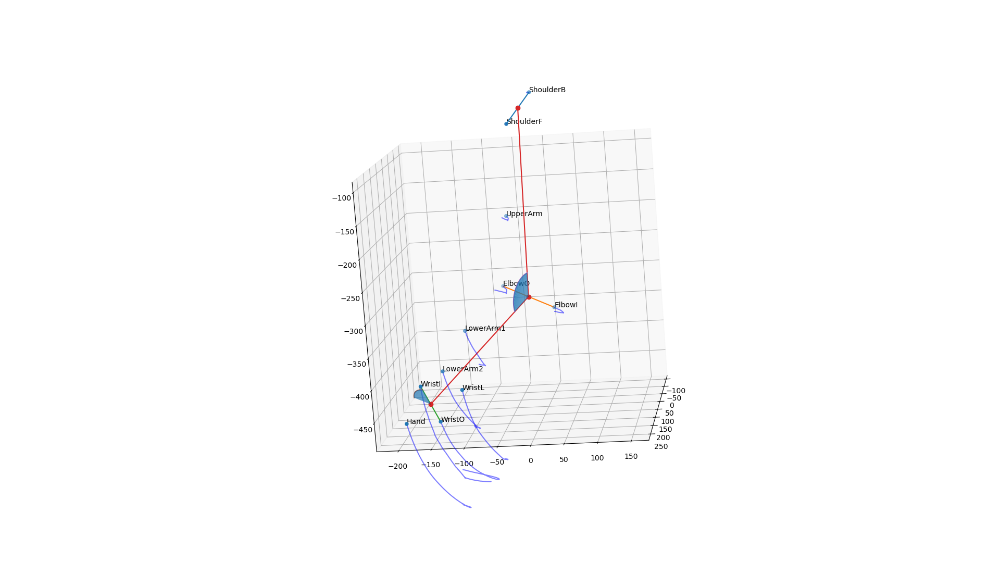
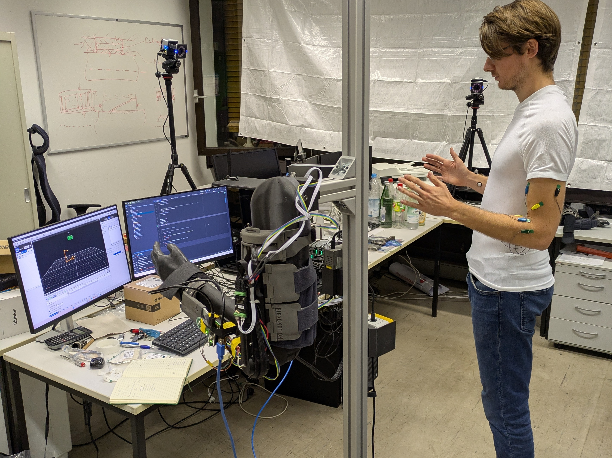
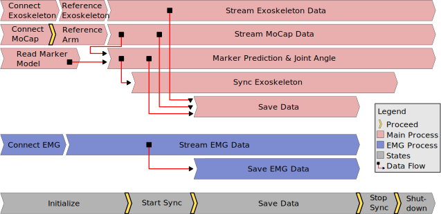
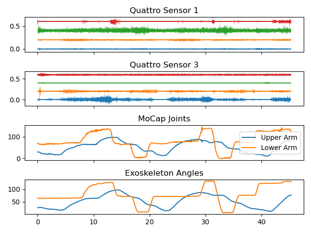
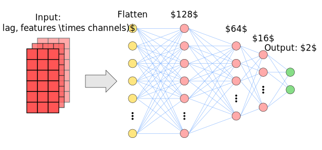
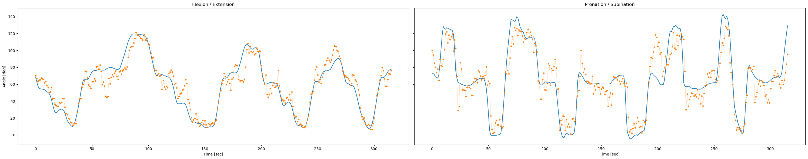

# Masterthesis

Inside this repository the corresponding files to the Masterthesis **Machine Learning for predicting joint angles from
Eletromygraphy Signals: Towards Intuitve Exoskeleton Control** are located. 

## Bilateral Mirrored Training 

Data is generated using bilateral mirrored training to map EMG signals to corresponding joints angles, even 
with unilateral paralyzed patients. Herein the motion of the subject's healthy arm is captured using 
Vicon Motion Capturing. Two joint angles (elbow flexion/extension, forearm pronation/supination) are calculated 
based on the tracked markers: 

The calculated joint angles are mirrored to an exoskeleton prototype, allowing the unilateral paralyzed 
patients the execution of mirrored movements.  In parallel EMG signals are recorded on the bilateral arm during mirrored 
movements of both arms: 

<!---

-->

Executing [this](data_rec.py) file, with its submodules [Joint Angle Calculation](ViconMoCap.py), [EMG Recoder](EMGRecorder.py) and [Exoskeleton Driver](OrthosisMotorController) 
file starts the recording state machine, displayed below. 

## Data Preparation 

Joint angle data is affected by noise, which is either filtered or in other cases cut out, to retrieve a
cleaned dataset: 

EMG features or the positive EMG envelope are extracted from the data to train different types of deep learning models. 

## Models

Different kinds of models (models with proceeding feature extraction or only minimal preprocessing) are trained 
and optimized in a grid search, as can be seen [here](JointAnglePrediction.ipynb). 

Exemplary a feedforward architecture to process EMG features, extracted in 100ms windows is shown below: 

Furthermore, models are augmented with NARX functionality and trained using scheduled sampling: 

## Results 

Predicting unseen data yields high prediction accuracy (R² = 0.847). As can be seen in the plot below 
(blue: targets, orange: predictions made by the model), predicting the 
elbow flexion/extension joint works very good (R² = 0.93), while forearm pronation/supination 
works worse (R² = 0.763).

Grid search results show that a feature set comprised of MAV, WL, SSC and ZC, with five lagged EMG windows 
yield the best results. NARX functionality does not improve these results in a realistic testing scenario. 

